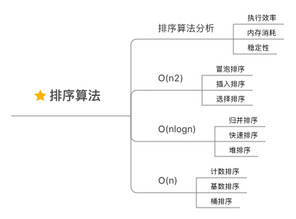

## 数据结构与算法学习总结

### 复杂度分析


#### 为什么需要复杂度分析

##### 事后统计法:
将代码在实际的环境跑一遍，得到运行的时间和所需要的内存大小。
##### 事后统计法局限性:
1. 测试结果非常依赖测试环境
2. 测试结果受测试数据规模影响很大

复杂度分析可以解决不用依赖具体测试数据、测试环境，就可以估算出算法的执行效率。


#### 大 O 复杂度表示法
所有代码的执行时间 T(n)，与每行代码的执行次数 n 成正比。
```
T(n) = O(f(n))
```
- T(n) 表示执行时间
- n 表示代码数据规模
- f(n) 表示每行代码的执行次数总和
- O 表示 T(n) 和 f(n) 成正比

`大O复杂度`表示代码执行时间与数据规模增长的变化趋势，也叫 `渐进时间复杂度`
			
#### 时间复杂度分析
1. 只关注循环执行次数最多的一段代码
2. 加法法则: 总复杂度等于量级最大的那段代码的复杂度
3. 乘法法则: 嵌套代码的复杂度等于嵌套内外代码复杂度的乘积

#### 几种常见的时间复杂度实例


### 线性表


##### 数组


##### 链表

##### 栈

##### 队列

---
### 排序算法



**冒泡排序**
```go
func BubbleSort(datas []int) []int {
	for i := 0; i < len(datas)-1; i++ {
		for j := 0; j < len(datas)-1-i; j++ {
			if datas[j] > datas[j+1] {
				tmp := datas[j]
				datas[j] = datas[j+1]
				datas[j+1] = tmp
			}
		}

	}
	return datas
}
```

**插入排序**
```go
func InsertSort(datas []int) []int {
	for i := 1; i < len(datas); i++ {
		if datas[i] >= datas[i-1] {
			continue
		}
		for j := 0; j < i; j++ {
			if datas[i] < datas[j] {
				tmp := datas[i]
				k := i
				for {
					if k == j {
						break
					}
					datas[k] = datas[k-1]
					k = k - 1
				}
				datas[j] = tmp
				break
			}
		}
	}
	return datas
}

```

**选择排序**
```go
func SelectSort(datas []int) []int {

	for i := 0; i < len(datas)-1; i++ {
		minIndex := i
		for j := i + 1; j < len(datas); j++ {
			if datas[minIndex] > datas[j] {
				minIndex = j
			}
		}
		tmp := datas[i]
		datas[i] = datas[minIndex]
		datas[minIndex] = tmp
	}
	return datas
}
```

**归并排序**
```go
func MergeSort(datas []int) []int {
	if len(datas) == 1 {
		return datas
	}
	left := MergeSort(datas[0 : len(datas)/2])
	right := MergeSort(datas[len(datas)/2 : len(datas)])

	return Merge(left, right)
}

func Merge(left, right []int) []int {
	leftLen := len(left)
	rightLen := len(right)
	sortDatas := make([]int, 0, leftLen+rightLen)

	i := 0
	j := 0

	for {
		if i == leftLen && j == rightLen {
			break
		}
		if i == leftLen {
			sortDatas = append(sortDatas, right[j:rightLen]...)
			break
		}
		if j == rightLen {
			sortDatas = append(sortDatas, left[i:leftLen]...)
			break
		}

		if left[i] < right[j] {
			sortDatas = append(sortDatas, left[i])
			i++
		} else {
			sortDatas = append(sortDatas, right[j])
			j++
		}
	}
	return sortDatas
}
```

**快速排序**
```go
func QuickSort(datas []int) []int {
	QuickSort_C(datas, 0, len(datas)-1)
	return datas
}

func QuickSort_C(datas []int, p, r int) {
	if p >= r {
		return
	}
	pivot := datas[r]
	i := p
	for j := p; j < r; j++ {
		if datas[j] < pivot {
			tmp := datas[j]
			datas[j] = datas[i]
			datas[i] = tmp
			i++
		}
	}
	tmp := datas[i]
	datas[i] = datas[r]
	datas[r] = tmp

	QuickSort_C(datas, 0, i-1)
	QuickSort_C(datas, i+1, r)
}
```
